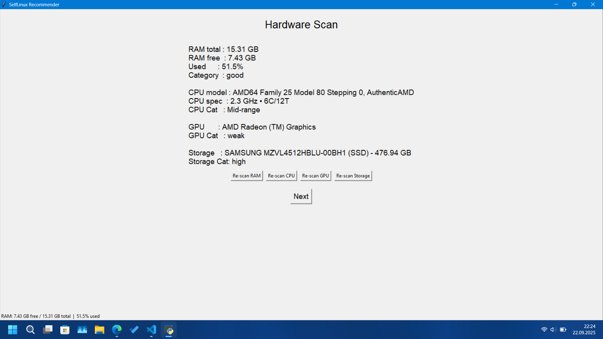
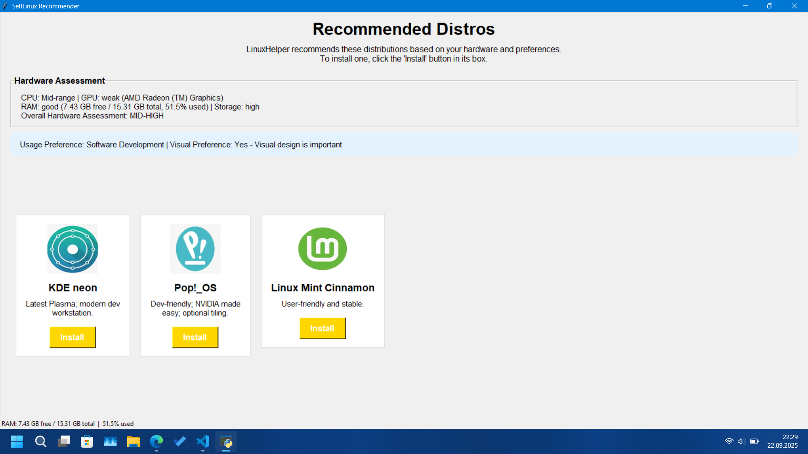

# LinuxHelper (Old Name: SelfLinux)

  

Ok.. this is my first project on github... Introducing to you: LinuxHelper! (It's old name was selflinux but I changed it to LinuxHelper now) LinuxHelper is an intelligent Linux distribution recommender and USB installer that analyzes your hardware and preferences to suggest the most suitable Linux distributions for your system.

## 🌟 Features

- **Hardware Detection**: Automatically scans and analyzes your CPU, GPU, RAM, and storage
- **Smart Recommendations**: Suggests Linux distributions based on your hardware capabilities and preferences
- **Visual Customization**: Choose between performance-focused or visually appealing distributions
- **Usage Optimization**: Tailored recommendations for gaming, office work, or software development
- **One-Click Installation**: Downloads your chosen distribution and writes it directly to a USB drive
- **Seamless Experience**: Handles the entire process from recommendation to reboot

## 📸 Screenshots

  
  

## 🚀 Installation

1.) Download the project from the github site
2.) Go ahead and run the LinuxHelper.exe with admin privileges.
Note: If the .exe gives library error, you need to install these 4 libraries: pillow (for showing the distros's logos in the recommendation screen), tkinter (for GUI), Psutil (for probing most of your hardware) and finally GPutil (for probing your GPU model). You can install each of them with the `pip install <library>` command.

## System Requirements
- Windows 8 or later (required for advanced boot options)
- Administrator privileges (required for USB writing)
- Internet connection (for downloading ISO files)
- USB drive (4GB+ recommended) for installation
- Python 3.6+ (if running from source)

## 🔧 How It Works

1. **Hardware Analysis**: LinuxHelper scans your system's CPU, GPU, RAM, and storage
2. **Preference Selection**: Choose your usage needs and visual preferences
3. **Recommendation Engine**: Intelligent algorithm suggests the most suitable distributions
4. **ISO Download**: Downloads your selected distribution' s ISOfrom my Google drive server (The versions in my Google Drive may be outdated, so after you install the distribution, update your system!! )
5. **USB Writing**: Creates a bootable USB drive with your chosen distribution
6. **Reboot Option**: Optionally reboot directly to BIOS/boot menu

## 🛠️ Technologies/Libraries Used

- Python 3.x
- Tkinter for GUI
- PyInstaller for executable creation
- Pillow for image support on the app
- GPutil for GPU probing
- Hardware detection libraries (psutil)
- PowerShell integration for system operations

## 🤝 Contributing

While I appreciate interest in this project, please note that as a student with limited time, I may not be able to review pull requests regularly. So don't expect fast feedback 😓. This is primarily a personal project for my portfolio.

## 📝 License

This project is licensed under the MIT License - see the [LICENSE](LICENSE) file for details.

## 🙏 Acknowledgements

- All the Linux distribution projects for their amazing work
- The open-source community for their invaluable resources
- And of course, those people who wrote Linux, Linus Torvalds and the others

## 📬 Contact

GitHub: [@gentoo888](https://github.com/gentoo888)

e-mail: metep788@gmail.com
second e-mail: meteparlak2020@outlook.com

Project Link: [https://github.com/gentoo888/LinuxHelper](https://github.com/gentoo888/LinuxHelper)
